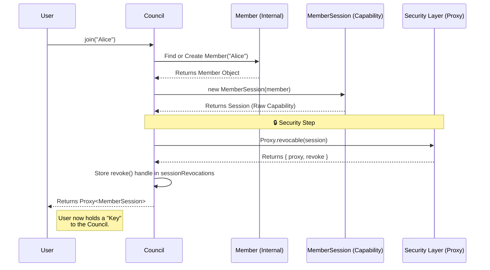
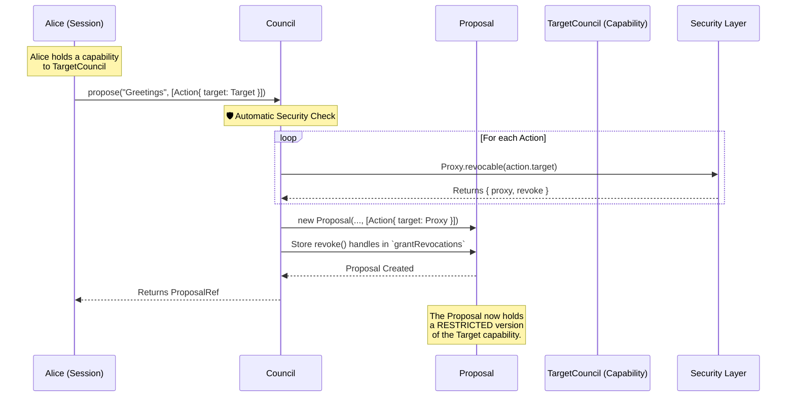
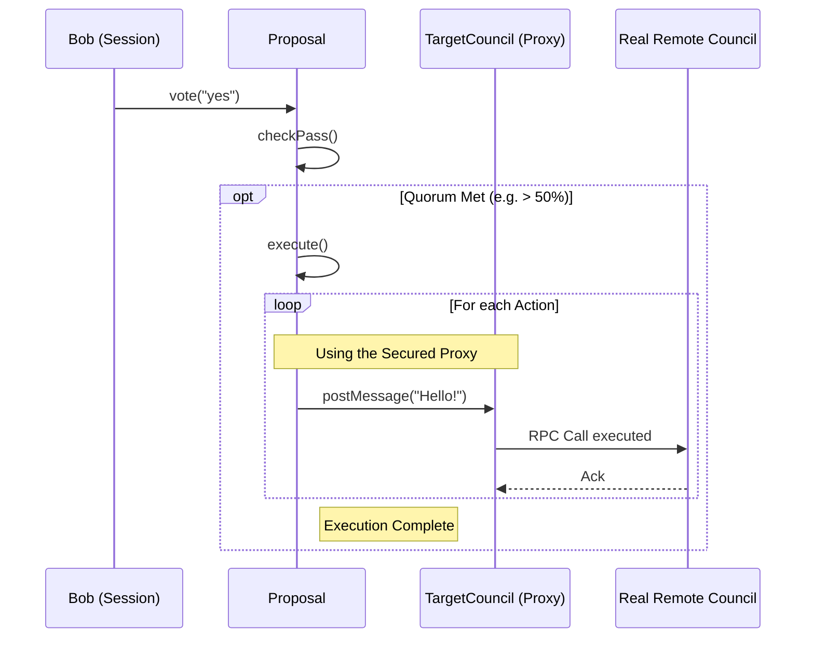
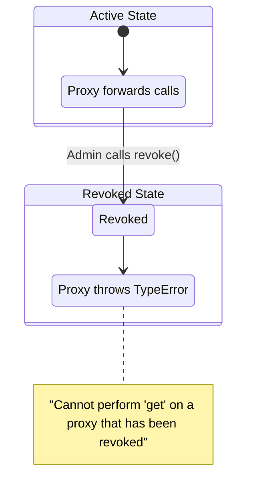

# System Architecture & Mechanics

This document visualizes the **Distributed Council System**, focusing on the Object Capability security model and the execution pipeline.

## 1. The Integrity: Joining & Session Creation
This flow demonstrates how a user acquires a **secure, revocable capability** (the Member Session) to interact with a Council. Note that the Council never returns a raw object; it always wraps it in a revocable proxy managed by the system.

## 2. The Flow: Proposal & Automatic Security
This diagram illustrates the **Zero-Trust** nature of the proposal system. When a member proposes an action that uses an external capability (like access to another council), the system **automatically intercepts and wraps** that capability before it enters the Proposal state. This ensures "Least Privilege" and allows the grant to be revoked later.

## 3. The Execution: Voting & Cross-Council RPC
This flow shows the "muscle" of the system. Once quorum is met, the system executes the action using the **wrapped capability** stored in the proposal.

## 4. The Fluidity: Revocation
How the system handles revocation of either a Member or a Proposal's grants.

